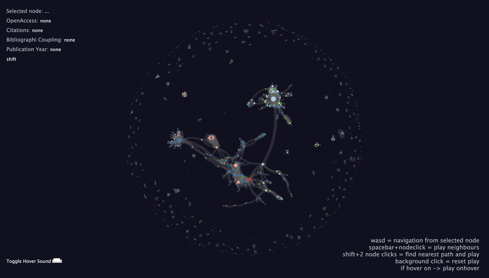

# Force-Layout Graph Sonification

[](https://doi.org/10.5281/zenodo.15197962)



An interactive interface for the sonification of graphs using OSC (Open Sound Control). This tool allows users to explore graph structures through both visual and auditory feedback. The force-directed graph web component in use is [force-graph](https://github.com/vasturiano/force-graph) by Vasco Asturiano.

## Features

- Interactive force-layout graph visualization
- Real-time sonification of graph elements
- Multiple interaction modes (hover, keyboard navigation, click events)
- OSC communication with SuperCollider for audio synthesis
- WebSocket-based real-time communication

## Requirements

- **SuperCollider** - [Download here](https://supercollider.github.io/)
- **Node.js** - Required for running the web server
<!-- - **Modern web browser** - For the interactive interface -->

## Installation

1. Clone this repository
2. Install dependencies:
   ```bash
   npm init -y
   npm install --save express osc-js ws
   ```

## Usage

### Starting the Application

1. **Launch the web server:**
   ```bash
   node server.js
   ```
   
2. **Open the displayed URL** in your web browser (typically `http://localhost:7700`)

3. **Configure SuperCollider:**
   - Open the file `graph_communication.scd` in SuperCollider
   - Boot the SuperCollider server
   - Evaluate the code by pressing `Cmd+Enter` (Mac) or `Ctrl+Enter` (Windows/Linux) on the highlighted portion

### Loading Graph Data

<!-- Graphs can be loaded as JSON data in the `helpers.js` file. See `/data/correct_output.json` for an example of the proper JSON format. -->
The displayed graph can be changed using the GUI menu at the top right of the interface.
To add new graphs, add their path in `force_graph.js` under `filedata` and `gui.add(obj, "file", [...])` and refresh the webpage. Each graph file should be complemented with a configuration file, examples of this can be found in `public/data/1-config.yml`.

## Interaction Modes

The interface supports four different interaction methods, each triggering both visual and sonic events:

### 1. Mouse Hover
- **Action:** Hover over any node
- **Effect:** Sonifies the selected node
- **Status:** Toggle enabled

### 2. WASD Navigation
- **Action:** Use W, A, S, D keys
- **Effect:** Navigate between nodes using keyboard
- **Audio:** Provides audio feedback for each node visited

### 3. Node Click (Neighbors)
- **Action:** Hold Spacebar + Click on a node
- **Effect:** Sonifies the number of neighbors temporally
- **Visual:** Highlights connected nodes

### 4. Shortest Path
- **Action:** Hold Shift + Click on two nodes
- **Effect:** Finds and sonifies the shortest path between the selected nodes
- **Visual:** Animates the path discovery

### 5. Background Reset
- **Action:** Click on empty background
- **Effect:** Resets the view to default state

<!-- ## Technical Details

- **Frontend:** HTML5, CSS3, JavaScript (ES6+)
- **Backend:** Node.js with Express
- **Communication:** WebSocket for real-time updates, OSC for audio
- **Audio Engine:** SuperCollider
- **Graph Layout:** Force-directed layout algorithm -->

<!-- ## File Structure

```
├── server.js              # Main server file
├── helpers.js             # Graph data loader
├── graph_communication.scd # SuperCollider code
├── data/
│   └── correct_output.json # Example graph data
└── graph-screen.png       # Interface screenshot
``` -->

## To-Do

- [ ] Implement cleaner keyboard shortcuts with [tinykeys](https://jamiebuilds.github.io/tinykeys/)
- [ ] Add loading screen with drag-and-drop file loading capability

## Contributing

Contributions are welcome! Please feel free to submit issues and pull requests.

## License

Please refer to the DOI link for citation and licensing information.

## Citation

If you use this tool in your research, please cite using the DOI: [10.5281/zenodo.15197962](https://doi.org/10.5281/zenodo.15197962)